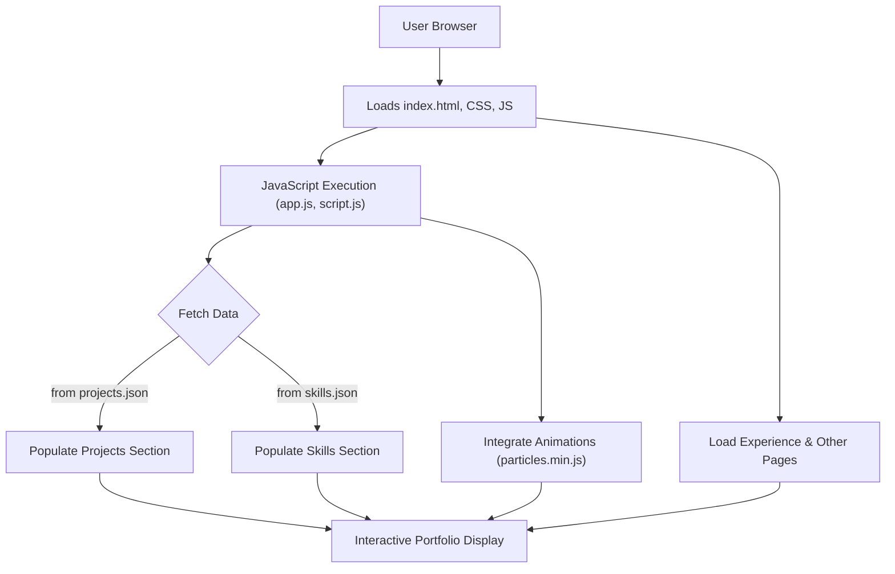

# 🚀 Dynamic Portfolio Website

<p align="center"></p>

## Short Description

Unleash your professional story with the **Dynamic Portfolio Website**! This repository hosts a sleek, modern, and highly interactive web presence designed to showcase your skills, projects, and professional journey with captivating flair. Crafted for impact, this portfolio serves as your digital handshake, combining aesthetic appeal with seamless functionality to leave a lasting impression.

## ✨ Key Features

*   **Engaging User Interface:** A visually stunning and responsive design ensures an exceptional experience across all devices.
*   **Dynamic Project Showcase:** Easily highlight your best work with a dedicated projects section, powered by `projects.json` for effortless updates.
*   **Comprehensive Skill Matrix:** Clearly categorize and display your technical proficiencies using a structured `skills.json` data source.
*   **Interactive Experience Timeline:** Present your professional and educational journey in an intuitive, chronological format.
*   **Automated Deployment (CI/CD):** Integrated GitHub Actions streamline the deployment process, ensuring your live site is always up-to-date with your latest contributions.
*   **Personalized 404 Page:** A custom 404 page provides a branded experience even when visitors stray from the path.
*   **Downloadable Resume:** A readily available `resume.pdf` allows instant access to your detailed qualifications.
*   **Particle Background Effects:** Subtle yet captivating animations (`particles.min.js`) add a layer of sophistication and dynamism.

## Who is this for?

This project is ideal for:

*   **Software Developers, Designers, and Creators:** Looking for an impressive and customizable platform to exhibit their work and attract opportunities.
*   **Job Seekers:** Who want to stand out with a professional and interactive online resume.
*   **Students & Professionals:** Aiming to build a strong personal brand and demonstrate their capabilities effectively.
*   **Anyone** wanting a ready-to-deploy, modern portfolio website with minimal setup.

## Technology Stack & Architecture

This project is built using a robust and widely-adopted front-end stack, focusing on performance, scalability, and ease of maintenance:

*   **HTML5:** The structural backbone of the entire website.
*   **CSS3:** Custom styling (`style.css`, `404.css`) for a modern, responsive, and visually appealing design.
*   **JavaScript:** Powers interactive elements, dynamic content loading (from JSON files), and animations (`app.js`, `script.js`, `particles.min.js`).
*   **JSON:** Used as a lightweight data storage format for managing project details (`projects.json`) and skill sets (`skills.json`).
*   **GitHub Actions:** Implements Continuous Integration/Continuous Deployment (CI/CD) workflows for automated testing and deployment of the static site.

## 📊 Architecture & Database Schema

As a static portfolio website, this project leverages client-side rendering and local JSON data sources, eliminating the need for a traditional database. The architecture focuses on efficient delivery of rich, dynamic content directly to the user's browser.



## ⚡ Quick Start Guide

Getting your personalized portfolio up and running is incredibly simple:

1.  **Clone the repository:**
    ```bash
    git clone https://github.com/shreyal123/portfolio_website.git
    cd portfolio_website
    ```
2.  **Customize your content:**
    *   Edit `projects/projects.json` to add your projects.
    *   Update `skills.json` with your technical skills.
    *   Modify the `index.html`, `experience/index.html`, and other HTML files with your personal details and content.
    *   Replace `assests/resume.pdf` with your own resume.
    *   Swap out images in `assests/images/` with your own profile pictures and project visuals.
3.  **Open in your browser:**
    Simply open `index.html` in your preferred web browser to view your portfolio locally.
    ```bash
    # For example, on macOS:
    open index.html
    ```
4.  **Deploy (Optional, via GitHub Pages):**
    This repository is configured for easy deployment via GitHub Pages using the `.github/workflows/ci-cd.yml` workflow. Push your changes to the `main` branch, and your site will automatically deploy!

## 📜 License

This project is licensed under the MIT License. See the `LICENSE` file for more details.